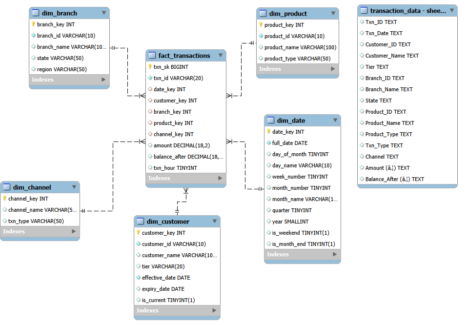

# Palladium Bank: Star Schema Data Warehouse Design

A dimensional data warehouse design for a retail bank operating across five Nigerian cities, built to replace slow, inconsistent reporting against raw transaction logs with a fast, analysis-ready star schema.

## Business Problem

Palladium Bank operates across Lagos, Abuja, Kano, Port Harcourt, and Ibadan. All reports were running directly against 18 months of raw transaction logs, causing slow performance and inconsistent metrics. This project designs a star schema that lets the Head of Retail Banking analyze fee income, channel behavior, product performance, and customer churn quickly and consistently.

## Tools Used

SQL (schema design, indexing, partitioning) · dimensional modeling

## Schema Design

**Fact table**: `FACT_TRANSACTIONS`, grain set at one row per transaction — the most atomic level available, supporting full drill-down.

**Dimensions**:
- `DIM_CUSTOMER` — Customer ID, Name, Tier
- `DIM_BRANCH` — Branch ID, Name, State, Region
- `DIM_PRODUCT` — Product ID, Name, Type
- `DIM_CHANNEL` — Channel, Transaction Type
- `DIM_DATE` — fully generated, covering all 547 days in the 18-month window

`Txn_ID` is kept as a degenerate dimension directly in the fact table as a unique audit reference, avoiding an unnecessary extra table.

## Slowly Changing Dimensions (SCD)

- **`DIM_CUSTOMER` — SCD Type 2**: Customer Tier changes over time and is business-critical (e.g. Silver → Gold), so historical records are preserved rather than overwritten. This lets every transaction join to the tier held at that point in time — essential for questions like whether high-value customers were reducing activity before a tier change.
- **`DIM_BRANCH` — SCD Type 1**: Branch name/region updates are rare, non-analytical corrections, so a simple overwrite keeps the model lean.

## ETL Strategy & Data Quality

- Initial load processes 18 months of data in dependency order: `DIM_DATE` → static dimensions → `DIM_CUSTOMER` → `FACT_TRANSACTIONS`
- Incremental daily loads use `Txn_ID` for deduplication
- Four data quality checks enforced: referential integrity (orphan Customer_IDs quarantined), null validation, signage consistency (flagging negative deposit amounts), and duplicate detection

## Performance & Scalability

- Three drill-down hierarchies: Time (Year → Quarter → Month → Day), Geography (State → Branch), Product (Type → Name)
- `FACT_TRANSACTIONS` partitioned by month for faster MoM/QoQ queries as data grows
- Six indexes on foreign key columns to accelerate dimension joins
- A pre-aggregated table, `AGG_MONTHLY_BRANCH_REVENUE`, powers executive dashboards without scanning the full fact table on every run

## Files

| File | Description |
|---|---|
| `Palladium_Bank_Schema.sql` | Full star schema SQL — table creation, indexes, DIM_DATE population |
| `schema_diagram.png` | Visual entity-relationship diagram of the schema |
| `Palladium_Bank_Written_Explanation.pdf` | Full write-up: business problem, dimension design, SCD strategy, ETL approach |
